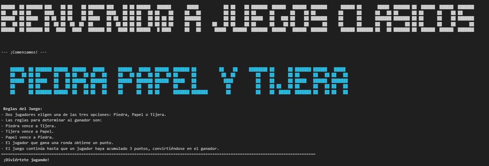
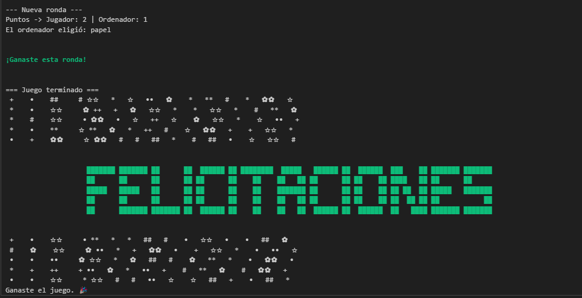
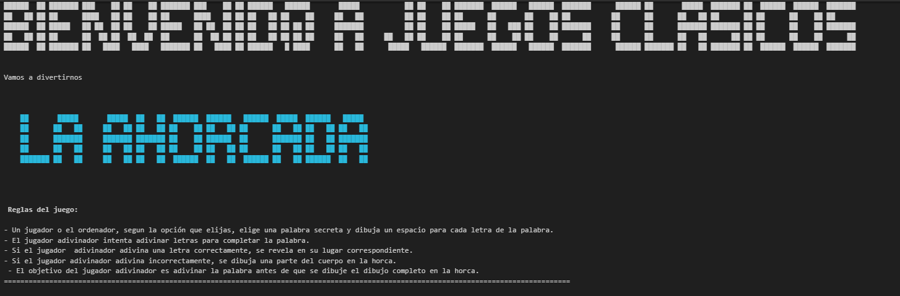
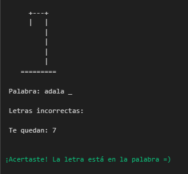
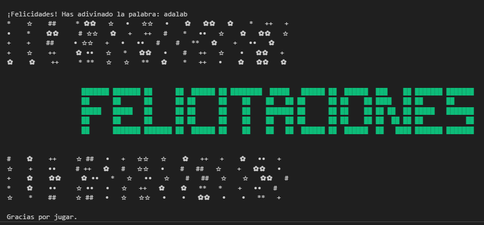
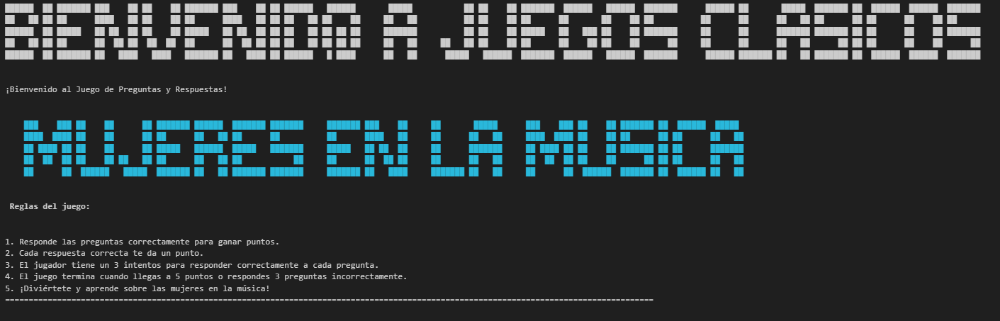
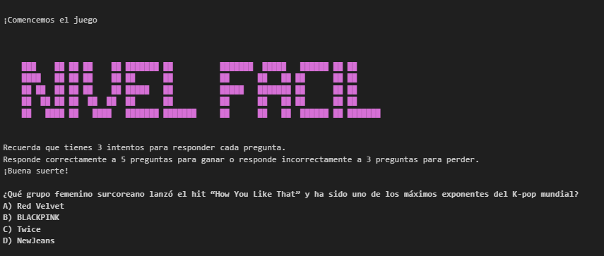
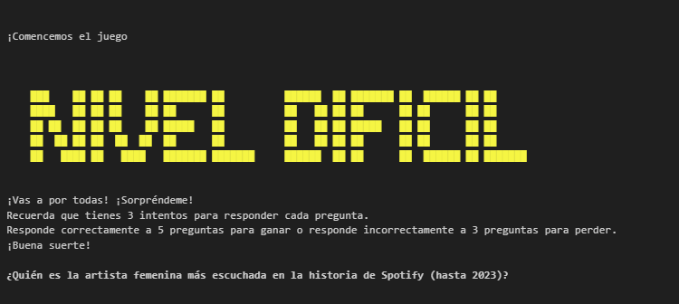

# Juegos Clásicos

Los juegos clásicos, son juegos transmitidos de generación en generación. .

Tienen reglas sencillas y fáciles de aprender, adaptándose a diferentes edades y culturas. 

Es una forma de entretenimiento, diversión o placer.

## 1. Piedra Papel o Tijera
     
Es un juego en el que dos jugadores seleccionan una de tres opciones: Piedra, Papel o Tijera. Cada opción tiene una relación de victoria diferente: la Piedra vence a la Tijera, la Tijera vence al Papel y el Papel vence a la Piedra. El objetivo del juego es elegir la opción que vencerá a la opción seleccionada por el oponente. El juego se juega en rondas y el jugador que gana más rondas es el ganador del juego.

## 2.  Ahorcado
    
Es un juego de adivinanzas en el que un jugador elige una palabra y el otro jugador debe adivinarla letra por letra. El jugador que adivina la palabra tiene un número limitado de oportunidades para adivinar las letras que forman la palabra. Cada vez que el jugador adivina una letra incorrecta, se dibuja una parte del cuerpo del personaje del ahorcado en una horca. Si el jugador adivina todas las letras de la palabra antes de que se complete el dibujo del personaje del ahorcado, gana el juego. Si el dibujo del personaje del ahorcado se completa antes de adivinar la palabra, pierde el juego.

## 3. Juego de preguntas y respuestas
    
Es un juego en el que se hacen preguntas sobre una variedad de temas y los jugadores deben responder correctamente para avanzar. Las preguntas pueden ser de diferentes categorías, como historia, ciencias, entretenimiento o cultura general. El objetivo del juego es responder la mayor cantidad de preguntas correctamente para ganar el juego. Este juego puede ser jugado de forma individual o en equipo y es una forma divertida de aprender y poner a prueba tus conocimientos.

# Estructura del Repositorio
```
proyecto-da-promo-paola-modulo-1-team-1/
├── .gitignore
├── README.md
├── data/
│   └── palabras_ahorcado.txt
├── notebooks/
│   ├── ahorcada.ipynb
│   ├── juegos_clasicos.ipynb
│   ├── piedra-papel-tijera.ipynb
│   └── preguntasyrespuestas.ipynb
└── recursos/
├── image-1.png
├── image-2.png
├── image-3.png
├── image-4.png
├── image-5.png
├── image-6.png
├── image-7.png
├── image-8.png
├── image-9.png
├── image-10.png
└── image.png
```

## Tecnologías usadas

[](https://www.python.org/)

Librerías: random, datetime, getpass.

Generador formato ascii: 
https://www.creativefabrica.com/es/tools/ascii-art-generator/

## Instrucciones de uso

1. Clona el repositorio.
2. Ejecuta el archivo principal: [link](https://github.com/lauraamber/proyecto-da-promo-paola-modulo-1-team-1/blob/main/notebooks/juegos_clasicos.ipynb)
3. Sigue las instrucciones en pantalla.

## Autoras

[Laura Parejo Aranda](https://github.com/lauraamber)

[Marta Sanz Muñoz](https://github.com/Martitaa)

[Clara Bueno García](https://github.com/cbueno82)

[Julia Becaria Coquet](https://github.com/juliabeco)

[Estefanía Moreno Delmo](https://github.com/fany_data)

## Estado del proyecto

Finalizado

## Capturas de pantalla
















